# 本の話

created by  Kai Katsumata (@raven_38_)

--

## お前誰？

* ICPCやってます。JOIやってました
* 機械学習とかに興味があります
* 慶應義塾大学環境情報学部１年

---

### 昔々

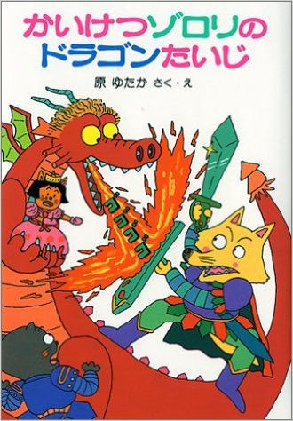
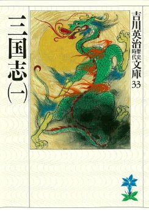

---

### 自己啓発・ビジネス本に傾倒

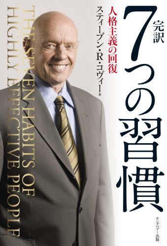
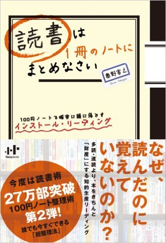

---

### 自己啓発？なにそれ

* 頭を使わなくても読める
* 読んだだけで自分が変わった気になれる
* 行動が伴わないと意味が無い

---

# 今の読書

* メディアセンターで借りて、気に入ったら買う
* 頭使わないと読めない本
* 面白い本

--

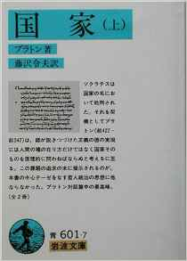
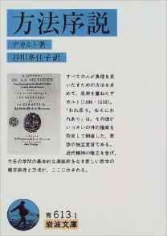

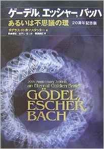
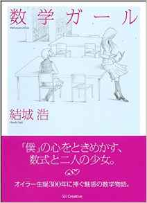

--

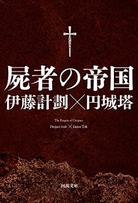
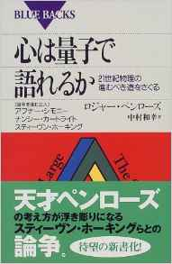
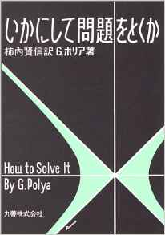
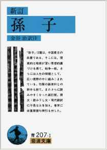

--

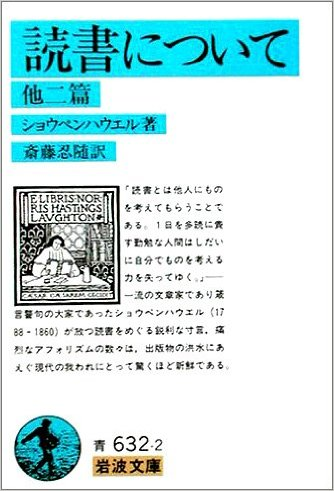
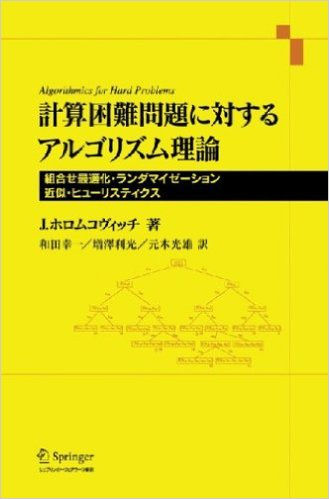

---

# 130,000,000

国立国会図書館だけで年間80万冊の書籍を受入れている

---

## 人生で読める本の数はわずか

---

## 何を読むか

---

## 僕はこうして本を選ぶ

* 出版年
* 著者
* はしがき、まえがき、序文、あとがき
* 目次
* 人の推薦

---

## 最近読んでよかったもの

---

### 『初恋』ツルゲーネフ

---

### 『生の短さについて』セネカ

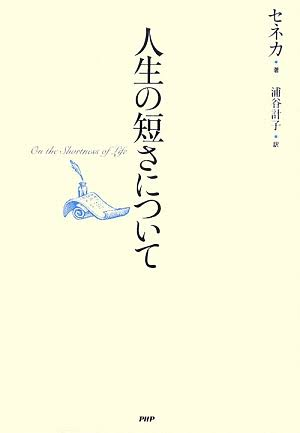
