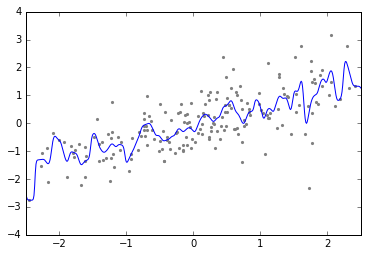

# 研究プラン 1秋

raven

---

## ryogaさんの宿題

---

### 同日のN225とTMのリターンを分析しているので面白くない

---

### 早朝に発表される経済指標とその日のN225のリターンを分析

### 経済指標の予測と結果の差異を利用する

---

## 懸念

* 毎日複数の指標が発表されてるが別々の指標を一緒に扱うと失敗しそう
* 一つの指標だとサンプルが12*15ぐらいしかとれない

---

## 手法、モデル

募集中(どうしたらいいですか？)
